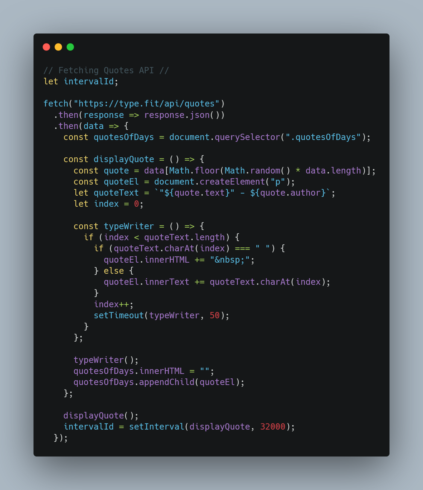

# Challenge 02 - Portfolio
This is an attempt to fix my 2nd challenge and able to show what my Bootcamp have been teaching me so far

## Languages and Framework

## Before and After
This is the link for old update: https://timothylai1121.github.io/Another-Portfolio/

This is the link for newest update : https://timothylai1121.github.io/Portfolio-Final/

## Snippet

## Reference

| Websites            | Urls                                                      |
| ------------------- | --------------------------------------------------------- |
| Shield.io           | [https://shields.io/]                                     |
| Banner Maker        | [https://banner.godori.dev/]                              |
| Javascript & Jquery | [https://javascriptbook.com/]                             |
| Carbon              | [https://carbon.now.sh/]                                  |
| YouTube             | [https://www.youtube.com/]                                |
| StackOverFlow       | [https://stackoverflow.com/]                              |
| Badges Git          | [https://github.com/Naereen/badges/blob/master/README.md] |
| Layoutit!           | [https://www.layoutit.com/]                               |

## Conclusion

"I'm on fire! I've stepped up my game since the last time we talked. I've mastered Tailwind CSS, rocked the API implementation, and made JavaScript and jQuery my new BFFs for all sorts of functions."
